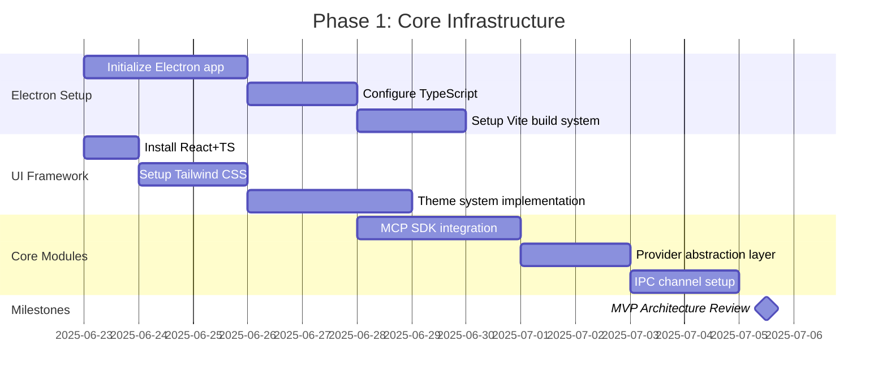
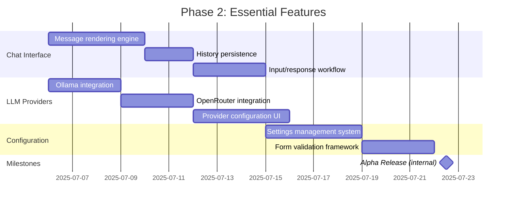
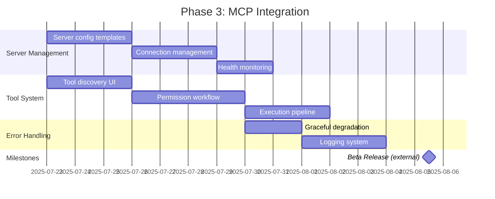
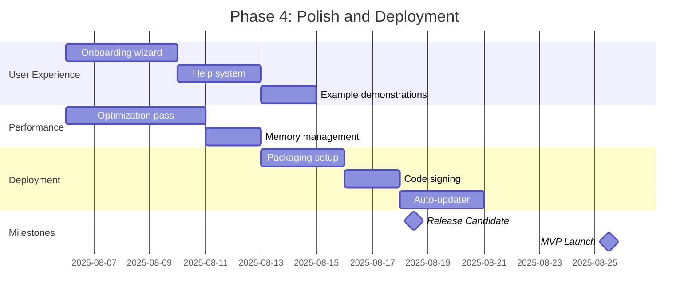

# NEXUS MVP Implementation Plan

## Phase 1: Core Infrastructure

## Phase 2: Essential Features

## Phase 3: MCP Integration

## Phase 4: Polish and Deployment

## Key Success Metrics
1. **Performance Targets**:
   - Startup time < 3s
   - Memory usage < 200MB
   - Tool execution timeout: 30s

2. **Integration Requirements**:
   - Support ≥3 MCP servers
   - Seamless Ollama/OpenRouter switching
   - Full permission workflow

3. **UX Standards**:
   - Zero-config first-run experience
   - Intuitive tool discovery
   - Contextual error guidance